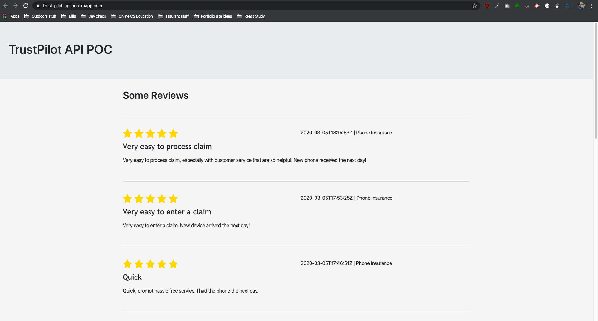

# Trust Pilot API POC

> Proof of concept of implementing trustpilot API

This app uses server-side rendering and protected environment variables to fetch data from the TrustPilot API. Every 5 minutes, it fetches a refresh token and refreshes the feed.



Technologies used:

- Node.js
- Express.js
- Handlebars.js
- Server-side rendering
- RESTful API services

## Installation

Git clone to your local then run

```sh
npm install
```

After installing dependencies, create a .env (see dotenv documentation) file and populate it with the following fields (fill in each field with correct data by following TrustPilot API Documentation):

```sh
API_KEY=
API_SECRET=
UNIT_ID=
CLIENT_ID=
REDIRECT_URI=
FIRST_REFRESH_TOKEN=
```

These fields would also need to be stored and accessed server-side as config variables.

Note: The `FIRST_REFRESH_TOKEN`
